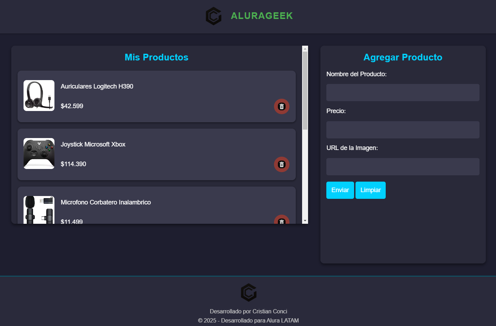
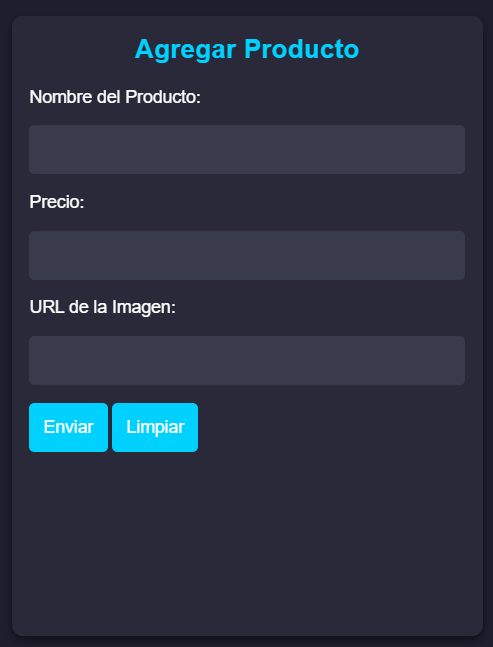

# AluraGeek 🛒

**AluraGeek** es un proyecto de e-commerce de productos tecnológicos desarrollado como parte del Challenge Alura LATAM. Este proyecto permite listar, agregar y eliminar productos dinámicamente, utilizando tecnologías modernas y simulando interacciones con una API.

## 🚀 Características

- **Visualización de productos**: Los productos se renderizan dinámicamente desde una API simulada.
- **Agregar productos**: Un formulario permite añadir nuevos productos con nombre, precio e imagen.
- **Eliminar productos**: Cada tarjeta de producto incluye un botón para eliminarlo de la lista.
- **Diseño responsivo**: La página está optimizada para adaptarse a diferentes tamaños de pantalla.
- **Estilo moderno**: Diseñada con colores y tipografías acordes a una temática tecnológica.

---

## 🛠️ Tecnologías Utilizadas

- **HTML5**: Estructura semántica de la aplicación.
- **CSS**: Diseño y estilos, utilizando Flexbox y Media Queries.
- **JavaScript**: Interactividad y funcionalidad dinámica (fetch, async/await).
- **JSON-Server**: Simulación de API para gestionar productos.
- **Git/GitHub**: Control de versiones y despliegue.

---

## 📷 Capturas de Pantalla

### Vista Principal


### Formulario de Agregar Producto



---

- **Link página en Vercel:**: https://alura-geek-psi-one.vercel.app/

---

## ⚙️ Instalación y Uso

1. Clona este repositorio en tu máquina local:
   ```bash
   git clone https://github.com/con-cris/alurageek.git

## ⚙️ Funcionalidades

### **GET** - Listar Productos
Los productos se obtienen desde el servidor y se renderizan dinámicamente en la sección "Mis Productos".

### **POST** - Agregar Producto
Un formulario permite crear un nuevo producto, que se añade a la API simulada.

### **DELETE** - Eliminar Producto
Cada tarjeta de producto incluye un botón para eliminarlo, enviando una solicitud DELETE al servidor.

---

## 🖌️ Diseño

- **Colores**: Paleta de tonos azules y grises, inspirados en temas tecnológicos.
- **Tipografía**: Fuentes modernas y legibles para una experiencia profesional.
- **Responsividad**: Optimización para dispositivos móviles y pantallas de escritorio.

---

## 👤 Autor

**Cristian Conci**  
Desarrollador Frontend en formación y educador apasionado por la tecnología.

---

## 📧 Contacto

Para consultas o sugerencias, puedes contactarme a través de:  
- **Email**: concicristian@gmail.com
- **GitHub**: https://github.com/con-cris
- **LinkedIn**: https://www.linkedin.com/in/cristianconci/
   
